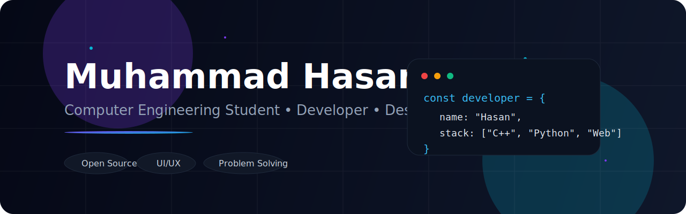

<div align="center">




</div>

---

## 🧠 About Me

```yaml
name        : Muhammad Hasan
location    : Karachi, Pakistan
university  : NED University of Engineering & Technology
degree      : Computer & Information Systems Engineering
role        : Freelance Web Developer
status      : Open to Projects & Collaborations

currently:
  - Studying OOP, Data Structures & Systems Design
  - Building client websites & freelance projects
  - Exploring AI, Cybersecurity & Emerging Tech

philosophy  : "Ship it. Improve it. Repeat."
```

---

## 🌐 Connect

<div align="center">

[](https://linkedin.com/in/MuhammadHasan)
[](https://hasan-3456.github.io/Profile)
[](mailto:hsweb91@gmail.com)
[](https://wa.me/923344073101)

</div>

---

## 💻 Tech Stack

<div align="center">


</div>

---

## 🚀 Featured Projects

| Project | Description | Stack |
|--------|-------------|-------|
| 🔌 [Rafay Power Solutions](https://rafay-power.com.pk) | Full company website — dark theme, SEO optimized, animations | HTML · CSS · JS · GSAP |
| 📚 Library Management System | OOP-based LMS with HTTP backend & frontend UI | C++ · cpp-httplib · HTML/CSS/JS |
| 🌐 Dev Portfolio | Personal portfolio with typed animation & project showcase | HTML · CSS · JS |

---

## 📊 GitHub Stats

<div align="center">


</div>

---

## 🏆 GitHub Trophies

<div align="center">


</div>

---

## 💬 Dev Quote

<div align="center">


</div>

---

## 🐍 Contribution Snake

<div align="center">


</div>

---

<div align="center">


</div>
